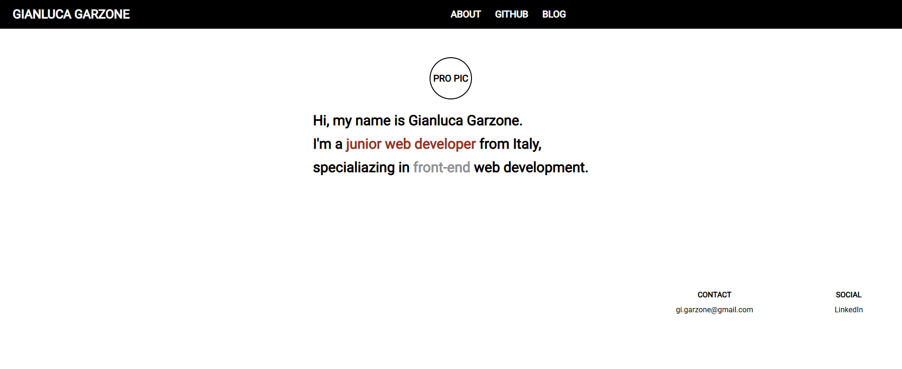

# 🌍 Gianluca Garzone - Portfolio Website

A clean and responsive **personal portfolio website** built using only **HTML5** and **CSS3**, designed to present who I am and where to find me online.

## 🚀 Demo

📎 [Live Website](https://gianni16.github.io/webpage) &nbsp; _(hosted with GitHub Pages)_

## 🧰 Technologies Used

- HTML5
- CSS3
- Google Fonts (Roboto)

## 🎯 Purpose

This website acts as my personal digital business card and portfolio. It includes links to my:
- GitHub profile
- LinkedIn profile

## 💡 Features

- Clean, minimalist design
- Responsive layout
- Simple CSS styling (no JavaScript)
- Links open in a new tab
- Structured footer with contact and social info

## 📸 Demo Preview



## 🖥️ How to Run the Project

1. Clone the repository:
   ```bash
   git clone https://github.com/Gianni16/webpage.git
